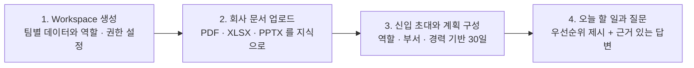
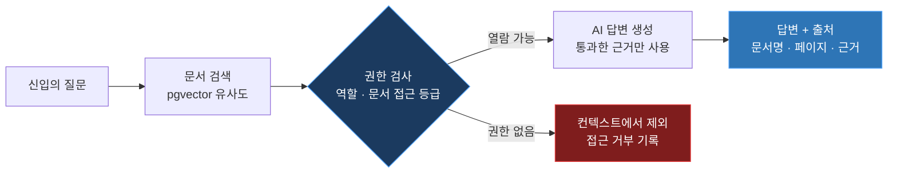

#  MenTalk

### 입사 첫날부터, 방향은 명확하게

흩어진 문서들 사이에서 길부터 보여주는 **온보딩의 시작점**

### [onboarding-platform-pearl.vercel.app](https://onboarding-platform-pearl.vercel.app/)

TEAM 사수없음 · 멋쟁이사자처럼 14기 중앙해커톤

---

## 팀 사수없음

|  |  |  |  |  |
|:---:|:---:|:---:|:---:|:---:|
| **김세원** <a href="https://github.com/RHOAN-SW">@RHOAN-SW</a> | **송하성** <a href="https://github.com/HaSung2">@HaSung2</a> | **민진홍** <a href="https://github.com/jinhgit">@jinhgit</a> | **장선호** <a href="https://github.com/jjangjjangsunho">@jjangjjangsunho</a> | **최인준** <a href="https://github.com/cij041109-del">@cij041109-del</a> |
| `Frontend` | `Frontend` | `Backend` | `Backend` | `Backend` |

---

## 문제

Notion · Slack · Drive · GitHub 등 자료는 넘치지만 신입은 오늘 무엇부터 할지 모릅니다.

| 흩어진 업무 정보 | 질문하기 어려운 환경 | 반복되는 온보딩 |
|---|---|---|
| 어떤 자료를 먼저 보고 어떻게 업무로 연결해야 하는지 알기 어렵습니다. | 누구에게 물어야 할지 모르고, 반복 질문 자체가 부담이 됩니다. | 멘토와 팀 리더가 매번 업무 순서를 설명하며 핵심 업무 시간이 줄어듭니다. |

이 시간은 **신입의 첫 업무 지연 · 멘토의 반복 설명 · 팀마다 달라지는 온보딩 품질**로 이어집니다. 온보딩 실패는 개인의 문제가 아니라 운영 시스템의 부재입니다.

> [!IMPORTANT]
> **핵심 문제** — 정보는 이미 충분합니다. 문제는 **'순서'가 없다는 것**입니다.

## 해결 — 계획에서 끝나지 않고, 오늘의 행동까지

기존 도구는 답변은 주지만 신입 적응을 *운영*하지 못합니다. 범용 ChatGPT는 회사 맥락과 권한을 모르고, Notion · Slack AI는 질문해야 답하고, 단순 RAG 챗봇은 문서는 찾지만 그다음 행동을 설계하지 못합니다.

MenTalk은 **다음 행동을 설계합니다.**

| | | |
|:---:|:---:|:---:|
| **PLAN** | **ACT** | **TRACK** |
| 신입에게 맞는 30일 계획을 설계합니다 | 오늘 해야 할 일을 먼저 보여줍니다 | 어디서 막히는지 바로 확인합니다 |

관리자의 한 번의 설정이 신입의 매일로 이어집니다.

> **문서를 찾는 AI가 아니라, 신입의 첫 30일을 운영하는 AI**
> 관리자는 매번 설명하지 않고, 신입은 매번 묻지 않아도 됩니다.

## 주요 기능

### 오늘 할 일

30일 계획이 날짜에 맞춰 오늘의 할 일로 전환됩니다. 신입은 접속하는 순간 다음 행동을 봅니다.

- **문서 읽기 · 체크리스트 · 실습/업무** 세 갈래로 나뉘어, 읽을 것과 확인할 것과 직접 해볼 것이 섞이지 않습니다
- 완료할 때마다 상단 진행률과 관리자 대시보드에 **즉시 반영**됩니다
- **추천 기준을 공개합니다.** 우선순위 · 마감 시간 · 현재 진행 상황 · 팀 목표 중 무엇을 고려했는지 펼쳐 볼 수 있어, 왜 이 일이 오늘인지 납득할 수 있습니다
- 지금 할 수 없는 항목은 **건너뛰기**로 넘기면 추천에서 빠집니다

### 30일 인수인계 계획

역할 · 부서 · 경력 수준을 지정하면 회사 문서를 근거로 30일치 계획이 만들어집니다.

- 전체 30일과 **주차별 보기**를 오가며 일차 단위로 항목과 진행률을 확인합니다
- 계획이 현실과 어긋나면 **재생성**합니다. 이미 끝낸 항목을 **유지한 채 나머지만** 다시 구성할지, 전체를 새로 짤지 선택할 수 있어 진행 중인 신입에게도 안전합니다
- 자주 쓰는 과정은 **템플릿**으로 저장해 다음 신입에게 그대로 적용합니다

### AI 질문과 출처

궁금한 것을 물으면 회사 문서만 근거로 답합니다.

- 답변마다 **문서명과 쪽수**를 칩으로 달아, 답을 그대로 믿는 대신 원문으로 넘어가 확인할 수 있습니다
- **추천 질문**으로 무엇을 물어야 할지 모르는 상태를 먼저 풀어줍니다
- **대화 기록**이 주제별로 남아, 지난 답변을 다시 찾거나 이어서 물을 수 있습니다

### 관리자 진행 현황

신입별 진행률과 막히는 지점을 한 화면에서 봅니다.

- **진행 중인 신입 수 · 평균 완료율 · 병목 감지 건수**를 상단에서 한눈에 확인합니다
- 신입별로 입사일, 전체 진행률, 완료/전체 항목, **병목 상태**, 최근 활동이 한 행에 정리됩니다
- **AI 인사이트**가 병목의 원인을 분석해 개선 방향을 제안합니다

온보딩이 개인의 성실함이 아니라 **관리 가능한 지표**가 됩니다.

## 권한 없는 정보는 처음부터 AI에게 전달되지 않습니다

AI도 사람과 동일한 권한 체계 안에서 작동하고, 누가 무엇을 조회했는지 추적할 수 있습니다.

| 원칙 | 내용 |
|------|------|
| **회사별 데이터 분리** | 워크스페이스 단위로 데이터 범위를 분리해 다른 팀의 문서와 업무 정보가 섞이지 않습니다. |
| **역할별 접근 제어** | `OWNER` · `ADMIN` · `MANAGER` · `MEMBER` · `NEW_HIRE` 5단계. AI 역시 동일한 권한 검사를 거칩니다. |
| **모든 행동 기록** | AI 질문 · 문서 조회 · 접근 거부 등 주요 이벤트를 감사 로그로 남깁니다. |

> [!TIP]
> OpenAI 키가 없어도 한국어 키워드 검색 기반 RAG로 폴백해 전체 흐름이 동작합니다.

## 시장과 확장

타겟은 채용과 조직 변화가 빠른 **20~500명 규모 IT 스타트업**입니다. 문서와 업무는 계속 늘어나는데 신입 적응은 여전히 사수의 설명에 의존하는, 여러 협업 도구를 쓰고 신입 교육 부담이 큰 조직입니다.

별도 구축 없이 워크스페이스 단위로 한 팀부터 시작하고, 신입 적응 속도와 관리 부담 개선을 확인한 뒤 다른 팀 · 직무로 확장합니다. HR · People Ops · 팀 리더가 도입하고, 신입과 멘토가 매일 사용합니다.

> **채용은 빨라졌습니다. 이제 온보딩도 빨라져야 합니다.**

## 기술 스택

### Frontend

    

### Backend

     

### Database & AI

   

### Infrastructure

   

### Development

     

---

### 사람이 바뀌어도 업무는 끊기지 않도록

TEAM 사수없음 · 멋쟁이사자처럼 14기 중앙해커톤

[onboarding-platform-pearl.vercel.app](https://onboarding-platform-pearl.vercel.app/)

