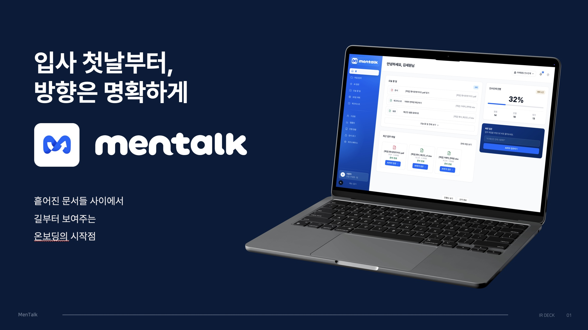
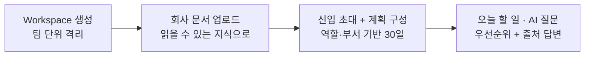
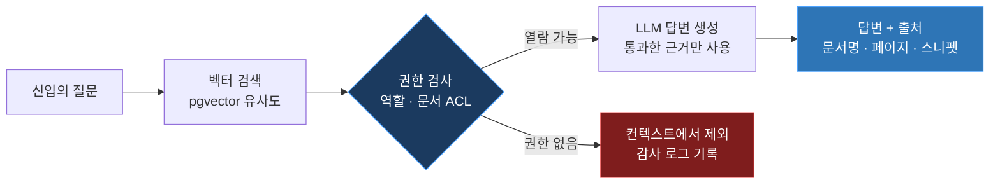

#  MenTalk

### 사람이 바뀌어도 업무는 끊기지 않게.

**신입의 Time To Productivity(TTP)를 줄이는 온보딩 운영체제**

문서를 검색해주는 챗봇이 아니라, 30일 계획을 세우고 · 오늘 할 일로 바꾸고 · 완료까지 추적합니다.

### [onboarding-platform-pearl.vercel.app](https://onboarding-platform-pearl.vercel.app/)

멋쟁이사자처럼 14기 중앙해커톤

---

## 팀 사수없음

|  |  |  |  |  |
|:---:|:---:|:---:|:---:|:---:|
| **김세원** <a href="https://github.com/RHOAN-SW">@RHOAN-SW</a> | **송하성** <a href="https://github.com/HaSung2">@HaSung2</a> | **민진홍** <a href="https://github.com/jinhgit">@jinhgit</a> | **장선호** <a href="https://github.com/jjangjjangsunho">@jjangjjangsunho</a> | **최인준** <a href="https://github.com/cij041109-del">@cij041109-del</a> |
| `Frontend` | `Frontend` | `Backend` | `Backend` | `Backend` |

---

## 문제

### 첫 출근 날의 풍경

계정을 발급받고, 슬랙 워크스페이스에 초대되고, 노션 링크 몇 개를 전달받습니다. 환영 인사가 끝나고 자리에 앉은 신입의 머릿속에 남는 질문은 하나입니다.

> **"그래서 지금 뭐부터 해야 하지?"**

회사는 이미 충분한 문서를 갖고 있습니다. 문제는 문서가 없는 게 아니라, **문서를 어떤 순서로 읽고 무엇을 먼저 해야 하는지가 설계되어 있지 않다는 것**입니다.

### 왜 이런 일이 반복되는가

**문서는 도구마다 흩어져 있습니다.**
업무 매뉴얼은 노션에, 최신 결정은 슬랙 스레드에, 실제 양식은 드라이브에, 코드 컨벤션은 깃허브 위키에 있습니다. 각 문서는 잘 쓰여 있지만 어느 것을 먼저 봐야 하는지는 어디에도 적혀 있지 않습니다. 결국 업무의 순서는 문서가 아니라 **사람의 설명에 의존**하게 됩니다.

**질문에는 비용이 붙습니다.**
모르는 것이 생겨도 신입은 바로 묻지 못합니다. 누구에게 물어야 할지, 지금 물어봐도 되는 타이밍인지, 이 정도는 알아서 찾아야 하는 건 아닌지부터 판단해야 합니다. 그 망설임 동안 진도는 멈추고, 검색으로 때우다 잘못된 옛날 문서를 붙잡는 일이 생깁니다.

**같은 설명이 매번 되풀이됩니다.**
멘토와 팀 리더는 신입이 들어올 때마다 거의 동일한 내용을 처음부터 다시 설명합니다. 설명의 품질은 그날의 여유와 담당자의 성향에 좌우되고, 그 시간만큼 본인의 핵심 업무는 밀립니다. 온보딩 경험이 팀마다, 사람마다 달라지는 이유입니다.

### 이 시간은 세 곳에서 비용이 됩니다

| 주체 | 발생하는 비용 | 결과 |
|------|--------------|------|
| **신입** | 무엇을 해야 할지 몰라 탐색하는 시간이 누적 | 첫 성과까지의 기간이 길어짐 |
| **멘토** | 가이드·질문 응대·상태 확인의 반복 | 본인 업무 시간이 잠식됨 |
| **조직** | 온보딩 품질이 팀 리더 역량에 좌우됨 | 표준이 없어 생산성이 팀마다 달라짐 |

> [!IMPORTANT]
> 신입이 **"무엇부터 해야 하는지 모르는 시간"** 이 곧 TTP(Time To Productivity) 지연입니다.
> 온보딩 실패는 개인의 문제가 아니라 **운영 시스템의 부재**입니다.

## 해결 — PLAN → ACT → TRACK

관리자의 한 번의 설정이 신입의 매일 할 일로 이어집니다.

| 단계 | 하는 일 |
|------|---------|
| **PLAN** | 문서·역할·부서를 기반으로 30일 계획을 생성 |
| **ACT** | 오늘 읽을 문서·체크리스트·실습을 우선순위로 추천 |
| **TRACK** | 완료율과 병목을 관리자에게 제공 |

> MenTalk의 목표는 "좋은 답변"이 아니라, 신입이 **독립적으로 첫 업무를 완수하는 시간을 줄이는 것**입니다.
> 다른 도구가 물어봐야 답하는 *Reactive Answer* 라면, MenTalk은 먼저 길을 제시하는 *Proactive Action* 입니다.

## 주요 기능

### 30일 온보딩 계획 자동 생성

관리자가 신입의 역할·부서·경력 수준을 지정하면 회사에 업로드된 문서를 근거로 30일치 계획이 만들어집니다. 계획은 *문서 읽기 · 체크리스트 · 실습* 단위로 쪼개지고, 관리자는 일자별로 항목을 확인하고 수정할 수 있습니다. 자주 쓰는 온보딩 과정은 템플릿으로 저장해 다음 신입에게 그대로 적용합니다.

### 오늘 할 일 추천

신입은 접속하는 순간 "오늘 무엇부터 해야 하는지"를 봅니다. 30일 계획이 날짜에 맞춰 자동으로 오늘의 할 일로 전환되고, 남은 시간·현재 진행 상황·팀 목표를 함께 고려해 우선순위가 정해집니다. 완료 상태는 곧바로 진행률에 반영됩니다.

### 출처가 붙는 AI 질문

궁금한 것을 물으면 회사 문서만 근거로 답합니다. 답변에는 **어떤 문서의 몇 쪽**을 참고했는지가 함께 표시되어, 신입이 답을 그대로 믿는 대신 원문으로 넘어가 확인할 수 있습니다. 멘토에게 물어보기 전 단계를 대신합니다.

### 문서 업로드와 접근 권한

PDF·XLSX·PPTX를 올리면 검색 가능한 지식으로 전환됩니다. 문서마다 접근 등급을 지정할 수 있고, **권한이 없는 문서는 AI 답변의 근거로도 쓰이지 않습니다.** 급여 자료 같은 민감 문서가 질문 한 번으로 새어나가지 않습니다.

### 진행 현황 대시보드

관리자는 신입별 진행률과 병목을 한 화면에서 봅니다. 누가 어느 단계에서 멈춰 있는지, 어떤 체크리스트가 지연되고 있는지, 문서 접근이 막혀서 진도가 안 나가는 건 아닌지가 드러납니다. 온보딩이 개인의 성실함이 아니라 관리 가능한 지표가 됩니다.

### 감사 로그

AI 질의, 문서 조회, 접근 거부 이벤트가 기록으로 남습니다. 언제 누가 어떤 문서에 접근했고 무엇이 거부됐는지 추적할 수 있어, 조직에 도입할 때 필요한 최소한의 통제 요건을 갖춥니다.

## 어떻게 동작하나

> [!NOTE]
> MenTalk의 AI는 **사람과 동일한 권한 체계 안에서만** 답변합니다.
> 권한 필터링은 LLM 호출 **이전**에 일어나므로, 볼 수 없는 문서는 답변의 근거로도 쓰이지 않습니다.

| 단계 | 내용 |
|------|------|
| **① 문서 처리** | 업로드된 문서를 텍스트로 파싱하고 의미 단위 청크로 분리해 PostgreSQL의 pgvector에 임베딩으로 저장합니다. |
| **② 권한 검사** | 검색된 청크 중 요청자의 역할·문서 접근 등급으로 열람 가능한 것만 남깁니다. 걸러진 청크는 LLM 컨텍스트에 **아예 들어가지 않습니다.** |
| **③ 답변 생성** | 통과한 근거만으로 답을 만들어, 근거 밖의 내용을 지어내지 않도록 합니다. |
| **④ 출처 제공** | 실제로 사용된 청크를 역추적해 문서명·페이지·스니펫을 답변에 붙입니다. |

이를 뒷받침하는 세 가지 원칙:

| 원칙 | 내용 |
|------|------|
| **Workspace 격리** | 모든 업무 데이터는 워크스페이스 단위로 분리되어, 다른 팀의 문서·구성원·계획에 접근할 수 없습니다. |
| **역할 기반 권한(RBAC)** | `OWNER` · `ADMIN` · `MANAGER` · `MEMBER` · `NEW_HIRE` 5단계로 기능과 문서 접근을 통제합니다. |
| **감사 추적** | 조회와 거부가 모두 로그로 남습니다. |

> [!TIP]
> OpenAI 키가 없어도 **한국어 키워드 검색 기반 RAG**로 폴백해 전체 흐름이 동작합니다.
> AI는 품질을 높이는 요소이지 서비스의 전제 조건이 아닙니다.

## 기술 스택

### Frontend

    

### Backend

     

### Database & AI

   

### Infrastructure

   

### Development

     

---

### MenTalk = Reduce Time To Productivity

**온보딩은 교육이 아니라 생산성 회복의 문제입니다.**

[onboarding-platform-pearl.vercel.app](https://onboarding-platform-pearl.vercel.app/)

