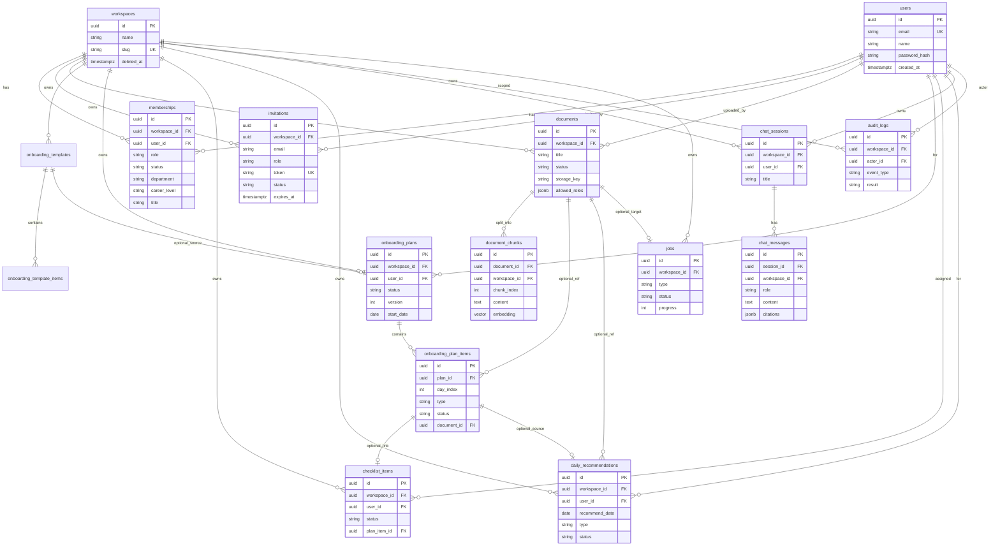

# OnboardOS — ERD (Entity Relationship Diagram)

| 항목 | 내용 |
|------|------|
| 문서명 | OnboardOS 데이터베이스 ERD / 데이터 모델 명세 |
| 버전 | 1.0 |
| 작성일 | 2026-07-29 |
| DBMS | PostgreSQL 16+ / **pgvector** |
| 정합 문서 | 상세 PRD · 기능명세서 · API 명세서 · AI_LEARN_FIRST |
| 핵심 원칙 | **Workspace Isolation** · RBAC · Permission-aware RAG · Soft delete 기본 |

---

## 0. 이 문서를 읽는 방법

| 독자 | 권장 섹션 |
|------|-----------|
| AI / 바이브코딩 | §1 개요 → §2 ER 다이어그램 → §4 제약 → §5 인덱스 → §8 마이그레이션 순서 |
| Backend | 전체, 특히 §3 테이블 상세 · §4 · §6 권한 모델 |
| FE / API 연동 | §2 · §3 PK/FK · enum · status 전이 |
| DBA / 보안 | §4 · §5 · §7 멀티테넌시 · §9 감사 |

**불변식 (DB 레벨에서도 지킬 것)**

1. 테넌트 경계는 `workspace_id` 다. 비즈니스 테이블은 (시스템 전역 `users` 제외) workspace 스코프를 가진다.
2. 벡터 검색 후보 청크는 반드시 `document` ACL / 역할 검사 후에만 LLM 컨텍스트로 사용한다. (DB만으로 전부 강제하진 못하지만, 스키마가 ACL 필드를 제공해야 한다.)
3. AI 질의·권한 거부는 `audit_logs`에 append-only로 남긴다.
4. Hard delete는 예외. 기본은 `deleted_at` soft delete.

---

## 1. 개요

### 1.1 바운디드 컨텍스트

```
┌─────────────────────────────────────────────────────────────────┐
│                     Identity & Access                            │
│   users · workspaces · memberships · invitations                 │
└────────────────────────────┬────────────────────────────────────┘
                             │ workspace_id
     ┌───────────────────────┼───────────────────────┐
     ▼                       ▼                       ▼
┌──────────────┐   ┌──────────────────┐   ┌─────────────────────┐
│  Knowledge   │   │   Onboarding     │   │   Conversation      │
│  documents   │   │   plans/items    │   │   chat_sessions     │
│  chunks      │   │   checklists     │   │   chat_messages     │
│  (pgvector)  │   │   recommendations│   │                     │
│  templates   │   │                  │   │                     │
└──────────────┘   └──────────────────┘   └─────────────────────┘
                             │
                             ▼
               ┌──────────────────────────┐
               │  Ops / Audit / Jobs       │
               │  audit_logs · jobs        │
               └──────────────────────────┘
```

### 1.2 엔티티 목록 (MVP)

| # | 테이블 | 컨텍스트 | MVP |
|---|--------|----------|-----|
| 1 | `users` | Identity | Y |
| 2 | `workspaces` | Identity | Y |
| 3 | `memberships` | Identity / RBAC | Y |
| 4 | `invitations` | Identity | Y |
| 5 | `documents` | Knowledge | Y |
| 6 | `document_chunks` | Knowledge / RAG | Y |
| 7 | `onboarding_templates` | Onboarding | Partial |
| 8 | `onboarding_template_items` | Onboarding | Partial |
| 9 | `onboarding_plans` | Onboarding | Y |
| 10 | `onboarding_plan_items` | Onboarding | Y |
| 11 | `checklist_items` | Onboarding | Y |
| 12 | `daily_recommendations` | Onboarding | Y |
| 13 | `chat_sessions` | Conversation | Y |
| 14 | `chat_messages` | Conversation | Y |
| 15 | `audit_logs` | Ops | Y |
| 16 | `jobs` | Ops | Y |

### 1.3 공통 컬럼 컨벤션

| 컬럼 | 타입 | 설명 |
|------|------|------|
| `id` | `UUID` PK | `gen_random_uuid()` (pgcrypto/pg16+) |
| `workspace_id` | `UUID` FK → workspaces | 테넌트 키 (users 제외) |
| `created_at` | `TIMESTAMPTZ` NOT NULL | 기본 `now()` |
| `updated_at` | `TIMESTAMPTZ` NOT NULL | 트리거 또는 앱 갱신 |
| `deleted_at` | `TIMESTAMPTZ` NULL | NULL = 활성 (soft delete) |

---

## 2. ER 다이어그램

### 2.1 논리 ERD (Mermaid)



### 2.2 관계 요약 (카디널리티)

| 부모 | 자식 | 관계 | ON DELETE (권장) | 설명 |
|------|------|------|------------------|------|
| users | memberships | 1:N | RESTRICT / soft | 유저 삭제 시 멤버십 정리 정책 필요 |
| workspaces | memberships | 1:N | CASCADE soft | 워크스페이스 폐기 시 |
| workspaces | invitations | 1:N | CASCADE | |
| users | invitations | 1:N | SET NULL | invited_by |
| workspaces | documents | 1:N | CASCADE soft | |
| documents | document_chunks | 1:N | **CASCADE** hard ok | 청크는 문서 종속 |
| workspaces | onboarding_templates | 1:N | CASCADE soft | |
| templates | template_items | 1:N | CASCADE | |
| workspaces | onboarding_plans | 1:N | CASCADE soft | |
| users | onboarding_plans | 1:N | RESTRICT | |
| plans | plan_items | 1:N | CASCADE | |
| documents | plan_items | 1:N | SET NULL | 문서 삭제 시 항목 유지 |
| users | checklist_items | 1:N | CASCADE soft | |
| plan_items | checklist_items | 1:0..1 | SET NULL | |
| users | daily_recommendations | 1:N | CASCADE | 일자별 재생성 가능 |
| users | chat_sessions | 1:N | CASCADE soft | |
| sessions | chat_messages | 1:N | CASCADE | |
| workspaces | audit_logs | 1:N | RESTRICT | 감사 로그 보존 |
| workspaces | jobs | 1:N | CASCADE | |

### 2.3 관계 다이어그램 (텍스트 ASCII — CLI 친화)

```
users ─────────────┬──────────────────┬──────────────────┐
                   │                  │                  │
                   ▼                  ▼                  ▼
            memberships ◄──── workspaces ────► documents ──► document_chunks
                   │                  │              │              │
                   │                  ├─ invitations │              │ (embedding vector)
                   │                  ├─ templates   │              │
                   │                  ├─ plans ──────┼─ plan_items ─┘ (optional document_id)
                   │                  ├─ checklists  │
                   │                  ├─ recommendations
                   │                  ├─ chat_sessions ── chat_messages
                   │                  ├─ audit_logs
                   │                  └─ jobs
                   │
                   └── role/department/career_level  → Planner 입력
```

---

## 3. 테이블 상세

### 3.1 `users`

글로벌 계정. **workspace에 종속되지 않음.**

| 컬럼 | 타입 | NULL | 기본 | 설명 |
|------|------|------|------|------|
| id | UUID | N | gen_random_uuid() | PK |
| email | VARCHAR(320) | N | | 로그인 ID, **UNIQUE** |
| name | VARCHAR(100) | N | | 표시 이름 |
| password_hash | VARCHAR(255) | N | | bcrypt/argon2 |
| is_active | BOOLEAN | N | true | 계정 활성 |
| last_login_at | TIMESTAMPTZ | Y | | |
| created_at | TIMESTAMPTZ | N | now() | |
| updated_at | TIMESTAMPTZ | N | now() | |
| deleted_at | TIMESTAMPTZ | Y | | soft delete |

**제약**

- `PK (id)`
- `UQ_users_email (email)` WHERE deleted_at IS NULL (부분 유니크 권장)
- `CHK_users_email_format` (앱 레벨 검증 필수; DB regex optional)

---

### 3.2 `workspaces`

회사/조직 테넌트. Isolation 경계.

| 컬럼 | 타입 | NULL | 기본 | 설명 |
|------|------|------|------|------|
| id | UUID | N | gen_random_uuid() | PK |
| name | VARCHAR(200) | N | | 회사명 |
| slug | VARCHAR(80) | N | | URL/식별용, **GLOBAL UNIQUE** |
| settings | JSONB | N | `{}` | 기본 가시성 등 |
| created_at | TIMESTAMPTZ | N | now() | |
| updated_at | TIMESTAMPTZ | N | now() | |
| deleted_at | TIMESTAMPTZ | Y | | |

**제약**

- `PK (id)`
- `UQ_workspaces_slug (slug)`
- `CHK_workspaces_slug` : `slug ~ '^[a-z0-9]+(?:-[a-z0-9]+)*$'`

**settings 예시**

```json
{
  "default_document_visibility": "WORKSPACE",
  "default_allowed_roles": ["MEMBER", "MANAGER", "ADMIN", "OWNER", "NEW_HIRE"]
}
```

---

### 3.3 `memberships`

User ↔ Workspace N:M + **역할·온보딩 프로필**.

| 컬럼 | 타입 | NULL | 기본 | 설명 |
|------|------|------|------|------|
| id | UUID | N | gen_random_uuid() | PK |
| workspace_id | UUID | N | | FK → workspaces |
| user_id | UUID | N | | FK → users |
| role | VARCHAR(30) | N | | enum Role |
| status | VARCHAR(20) | N | `ACTIVE` | ACTIVE / DISABLED |
| department | VARCHAR(100) | Y | | Planner 입력 |
| career_level | VARCHAR(30) | Y | | JUNIOR / MID / SENIOR / INTERN … |
| title | VARCHAR(100) | Y | | 직함/직무 |
| joined_at | TIMESTAMPTZ | N | now() | |
| created_at | TIMESTAMPTZ | N | now() | |
| updated_at | TIMESTAMPTZ | N | now() | |
| deleted_at | TIMESTAMPTZ | Y | | |

**제약**

- `PK (id)`
- `UQ_memberships_workspace_user (workspace_id, user_id)` WHERE deleted_at IS NULL
- `FK_memberships_workspace` → workspaces(id)
- `FK_memberships_user` → users(id)
- `CHK_memberships_role` : role IN (`OWNER`,`ADMIN`,`MANAGER`,`MEMBER`,`NEW_HIRE`)
- `CHK_memberships_status` : status IN (`ACTIVE`,`DISABLED`)

**비즈니스 규칙**

- Workspace당 `OWNER` ≥ 1 (앱 레벨 강제 권장; 트리거 optional).
- 자기 자신 단독 OWNER 강등 방지 (앱).

---

### 3.4 `invitations`

| 컬럼 | 타입 | NULL | 기본 | 설명 |
|------|------|------|------|------|
| id | UUID | N | | PK |
| workspace_id | UUID | N | | FK |
| email | VARCHAR(320) | N | | 피초대 이메일 |
| role | VARCHAR(30) | N | | 부여할 역할 |
| department | VARCHAR(100) | Y | | 수락 시 membership에 복사 |
| career_level | VARCHAR(30) | Y | | |
| title | VARCHAR(100) | Y | | |
| token | VARCHAR(64) | N | | **UNIQUE**, 초대 링크 |
| status | VARCHAR(20) | N | `PENDING` | PENDING / ACCEPTED / EXPIRED / REVOKED |
| invited_by | UUID | Y | | FK → users |
| expires_at | TIMESTAMPTZ | N | | |
| accepted_at | TIMESTAMPTZ | Y | | |
| created_at | TIMESTAMPTZ | N | now() | |
| updated_at | TIMESTAMPTZ | N | now() | |

**제약**

- `UQ_invitations_token (token)`
- `UQ_invitations_pending_email (workspace_id, email)` WHERE status = `PENDING` (부분 유니크)
- `CHK_invitations_status`
- `CHK_invitations_role` (NEW_HIRE 등 허용 역할)
- `FK` workspace, invited_by

**수락 시 트랜잭션**

1. invitation status → ACCEPTED  
2. membership INSERT  
3. (optional) onboarding_plans 생성 job 트리거  

---

### 3.5 `documents`

| 컬럼 | 타입 | NULL | 기본 | 설명 |
|------|------|------|------|------|
| id | UUID | N | | PK |
| workspace_id | UUID | N | | FK, **격리 키** |
| title | VARCHAR(500) | N | | |
| description | TEXT | Y | | |
| storage_key | VARCHAR(500) | N | | Supabase Storage path |
| original_filename | VARCHAR(500) | Y | | |
| mime_type | VARCHAR(120) | Y | | |
| size_bytes | BIGINT | Y | | |
| status | VARCHAR(20) | N | `PENDING` | 파이프라인 상태 |
| visibility | VARCHAR(20) | N | `WORKSPACE` | WORKSPACE / RESTRICTED |
| allowed_roles | JSONB | N | `[]` | 예: `["ADMIN","MANAGER"]` |
| error_message | TEXT | Y | | FAILED 사유 |
| chunk_count | INT | N | 0 | 비정규 카운터 |
| uploaded_by | UUID | Y | | FK users |
| created_at | TIMESTAMPTZ | N | now() | |
| updated_at | TIMESTAMPTZ | N | now() | |
| deleted_at | TIMESTAMPTZ | Y | | soft → 벡터 비활성 |

**status 전이**

```
PENDING → PROCESSING → READY
                    ↘ FAILED → (reprocess) → PENDING
```

**제약**

- `CHK_documents_status` IN (`PENDING`,`PROCESSING`,`READY`,`FAILED`)
- `CHK_documents_visibility` IN (`WORKSPACE`,`RESTRICTED`)
- `CHK_documents_size` size_bytes IS NULL OR size_bytes >= 0
- READY일 때만 RAG 검색 대상 (쿼리 조건: `status = 'READY' AND deleted_at IS NULL`)

**ACL 해석 규칙 (앱/PermissionService)**

| visibility | 동작 |
|------------|------|
| WORKSPACE | membership ACTIVE이면 기본 허용 (역할 제한 optional) |
| RESTRICTED | `allowed_roles`에 사용자 role 포함 시에만 허용 |

---

### 3.6 `document_chunks`

RAG 검색 단위. **pgvector** 저장.

| 컬럼 | 타입 | NULL | 기본 | 설명 |
|------|------|------|------|------|
| id | UUID | N | | PK |
| document_id | UUID | N | | FK → documents ON DELETE CASCADE |
| workspace_id | UUID | N | | **비정규 필수** — 검색 시 join 최소화·격리 |
| chunk_index | INT | N | | 문서 내 순서, 0-based |
| content | TEXT | N | | 청크 본문 |
| token_count | INT | Y | | |
| embedding | vector(1536) | Y | | 모델 차원에 맞춤 (OpenAI text-embedding-3-small = 1536) |
| metadata | JSONB | N | `{}` | page, heading, source_path 등 |
| created_at | TIMESTAMPTZ | N | now() | |

**제약**

- `UQ_chunks_doc_index (document_id, chunk_index)`
- `FK` document CASCADE
- `FK` workspace
- `CHK_chunk_index` chunk_index >= 0
- workspace_id는 부모 document.workspace_id와 **반드시 동일** (앱 또는 트리거 검증)

**검색 시 필수 필터**

```sql
WHERE workspace_id = :ws
  AND embedding IS NOT NULL
  -- join documents d ON d.id = document_id
  AND d.status = 'READY'
  AND d.deleted_at IS NULL
-- 이후 앱에서 role/ACL 필터
ORDER BY embedding <=> :query_vec
LIMIT :k
```

---

### 3.7 `onboarding_templates` / `onboarding_template_items`

역할별 골격. Planner 입력 (Partial MVP).

#### templates

| 컬럼 | 타입 | NULL | 설명 |
|------|------|------|------|
| id | UUID | N | PK |
| workspace_id | UUID | N | FK |
| name | VARCHAR(200) | N | |
| target_role | VARCHAR(30) | N | 주로 NEW_HIRE |
| description | TEXT | Y | |
| is_default | BOOLEAN | N | 기본 false |
| created_at / updated_at / deleted_at | | | |

- `UQ` (workspace_id, name) WHERE deleted_at IS NULL

#### template_items

| 컬럼 | 타입 | NULL | 설명 |
|------|------|------|------|
| id | UUID | N | PK |
| template_id | UUID | N | FK CASCADE |
| day_index | INT | N | 1~30 |
| type | VARCHAR(30) | N | PlanItemType |
| title | VARCHAR(500) | N | |
| description | TEXT | Y | |
| sort_order | INT | N | 0 |
| metadata | JSONB | N | `{}` |

- `CHK` day_index BETWEEN 1 AND 30
- `CHK` type IN PlanItemType

---

### 3.8 `onboarding_plans`

개인 30일 계획 헤더.

| 컬럼 | 타입 | NULL | 기본 | 설명 |
|------|------|------|------|------|
| id | UUID | N | | PK |
| workspace_id | UUID | N | | FK |
| user_id | UUID | N | | FK — 대상 신입 |
| template_id | UUID | Y | | FK SET NULL — 출처 스냅샷용 |
| status | VARCHAR(20) | N | `ACTIVE` | DRAFT / ACTIVE / COMPLETED / ARCHIVED |
| version | INT | N | 1 | 재생성 시 증가 |
| start_date | DATE | N | | 보통 입사/수락일 |
| end_date | DATE | N | | start + 29일 |
| progress_percent | NUMERIC(5,2) | N | 0 | 비정규 캐시 0~100 |
| generated_by | VARCHAR(20) | N | `AI` | AI / TEMPLATE / MANUAL |
| meta | JSONB | N | `{}` | 생성 프롬프트 요약 등 |
| created_at / updated_at / deleted_at | | | | |

**제약**

- `UQ_active_plan (workspace_id, user_id)` WHERE status = `ACTIVE` AND deleted_at IS NULL  
  → 활성 계획은 사용자당 1개
- `CHK` progress_percent BETWEEN 0 AND 100
- `CHK` end_date >= start_date
- `CHK` version >= 1

---

### 3.9 `onboarding_plan_items`

| 컬럼 | 타입 | NULL | 기본 | 설명 |
|------|------|------|------|------|
| id | UUID | N | | PK |
| plan_id | UUID | N | | FK CASCADE |
| workspace_id | UUID | N | | 비정규 격리 키 |
| day_index | INT | N | | 1~30 |
| type | VARCHAR(30) | N | | DOCUMENT / PERSON / CHECKLIST / PRACTICE |
| title | VARCHAR(500) | N | | |
| description | TEXT | Y | | |
| status | VARCHAR(20) | N | `PENDING` | PENDING / DONE / SKIPPED |
| sort_order | INT | N | 0 | 같은 날 내 순서 |
| document_id | UUID | Y | | FK SET NULL — type=DOCUMENT |
| person_name | VARCHAR(100) | Y | | type=PERSON |
| person_user_id | UUID | Y | | FK SET NULL — 사내 유저 매핑 시 |
| estimated_minutes | INT | Y | | |
| completed_at | TIMESTAMPTZ | Y | | |
| metadata | JSONB | N | `{}` | |
| created_at / updated_at | | | | |

**제약**

- `CHK` day_index BETWEEN 1 AND 30
- `CHK` type IN (`DOCUMENT`,`PERSON`,`CHECKLIST`,`PRACTICE`)
- `CHK` status IN (`PENDING`,`DONE`,`SKIPPED`)
- `CHK_plan_item_document` : type <> `DOCUMENT` OR document_id IS NOT NULL **(완화된 경우 NULL 허용 — 문서 미연결 안내 항목)**  
  → MVP: document_id NULL 허용, 제목만 있는 항목 OK
- 권한: plan 생성 시 **접근 불가 문서는 document_id로 넣지 않는다** (앱 규칙)

---

### 3.10 `checklist_items`

| 컬럼 | 타입 | NULL | 기본 | 설명 |
|------|------|------|------|------|
| id | UUID | N | | PK |
| workspace_id | UUID | N | | FK |
| user_id | UUID | N | | FK 담당 신입 |
| plan_item_id | UUID | Y | | FK SET NULL |
| title | VARCHAR(500) | N | | |
| description | TEXT | Y | | |
| status | VARCHAR(20) | N | `PENDING` | PENDING / DONE |
| due_day | INT | Y | | 계획 일 인덱스 |
| completed_at | TIMESTAMPTZ | Y | | |
| created_at / updated_at / deleted_at | | | | |

**제약**

- `CHK` status IN (`PENDING`,`DONE`)
- 본인만 완료 토글 (앱)

---

### 3.11 `daily_recommendations`

Proactive “오늘 할 일”.

| 컬럼 | 타입 | NULL | 기본 | 설명 |
|------|------|------|------|------|
| id | UUID | N | | PK |
| workspace_id | UUID | N | | FK |
| user_id | UUID | N | | FK |
| recommend_date | DATE | N | | 대상 일자 |
| type | VARCHAR(30) | N | | PlanItemType 동일 |
| title | VARCHAR(500) | N | | |
| status | VARCHAR(20) | N | `PENDING` | PENDING / DONE / DISMISSED |
| priority | INT | N | 1 | 낮을수록 우선 |
| source | VARCHAR(30) | N | `PLAN` | PLAN / AI / SYSTEM |
| plan_item_id | UUID | Y | | FK SET NULL |
| document_id | UUID | Y | | FK SET NULL |
| person_name | VARCHAR(100) | Y | | |
| metadata | JSONB | N | `{}` | |
| completed_at | TIMESTAMPTZ | Y | | |
| created_at / updated_at | | | | |

**제약**

- `IDX` (workspace_id, user_id, recommend_date)
- 동일 날짜 재생성 시 기존 PENDING 교체 또는 upsert 전략 (앱)
- 완료 시 연관 plan_item / checklist 동기화 (서비스 트랜잭션)

---

### 3.12 `chat_sessions` / `chat_messages`

#### sessions

| 컬럼 | 타입 | NULL | 설명 |
|------|------|------|------|
| id | UUID | N | PK |
| workspace_id | UUID | N | FK |
| user_id | UUID | N | FK |
| title | VARCHAR(200) | Y | 첫 질문 요약 |
| created_at / updated_at / deleted_at | | | |

#### messages

| 컬럼 | 타입 | NULL | 기본 | 설명 |
|------|------|------|------|------|
| id | UUID | N | | PK |
| session_id | UUID | N | | FK CASCADE |
| workspace_id | UUID | N | | 비정규 격리 |
| user_id | UUID | N | | 소유 검증용 |
| role | VARCHAR(20) | N | | `user` / `assistant` / `system` |
| content | TEXT | N | | |
| citations | JSONB | N | `[]` | assistant만 의미 있음 |
| permission_denied_document_ids | JSONB | N | `[]` | 거부된 문서 ID 목록 |
| model | VARCHAR(80) | Y | | 사용 모델 |
| token_usage | JSONB | Y | | prompt/completion |
| created_at | TIMESTAMPTZ | N | now() | |

**citations JSON 스키마**

```json
[
  {
    "documentId": "uuid",
    "title": "배포 가이드",
    "chunkId": "uuid",
    "snippet": "…",
    "page": 3
  }
]
```

**제약**

- `CHK` role IN (`user`,`assistant`,`system`)
- assistant 메시지: 앱에서 citations 필드 존재 강제 (빈 배열 허용)
- 타 user session 접근 금지

---

### 3.13 `audit_logs` (append-only)

| 컬럼 | 타입 | NULL | 설명 |
|------|------|------|------|
| id | UUID | N | PK |
| workspace_id | UUID | N | FK |
| actor_id | UUID | Y | FK users, 시스템이면 NULL |
| event_type | VARCHAR(50) | N | 아래 enum |
| resource_type | VARCHAR(50) | Y | DOCUMENT / CHAT / MEMBER … |
| resource_id | UUID | Y | |
| result | VARCHAR(20) | N | SUCCESS / DENIED / ERROR |
| message | TEXT | Y | |
| metadata | JSONB | N | `{}` |
| ip_address | VARCHAR(45) | Y | |
| created_at | TIMESTAMPTZ | N | now() **수정 없음** |

**event_type 예시**

| 코드 | 설명 |
|------|------|
| `CHAT_QUERY` | AI 질의 |
| `DOC_ACCESS_DENIED` | 문서 권한 거부 |
| `DOC_UPLOAD` | 문서 업로드 |
| `PLAN_GENERATE` | 온보딩 계획 생성 |
| `MEMBER_INVITE` | 초대 |
| `MEMBER_ROLE_CHANGE` | 역할 변경 |
| `LOGIN` | 로그인 (workspace 선택 전일 수 있음 — workspace NULL 허용 시 정책 결정) |

**제약**

- UPDATE/DELETE 금지 권장 (권한 REVOKE 또는 트리거로 차단)
- MVP: workspace_id NOT NULL (순수 LOGIN은 workspace 없이 별도 처리 가능)

---

### 3.14 `jobs`

비동기 문서 인제스트 등.

| 컬럼 | 타입 | NULL | 기본 | 설명 |
|------|------|------|------|------|
| id | UUID | N | | PK |
| workspace_id | UUID | N | | FK |
| type | VARCHAR(50) | N | | `DOCUMENT_INGEST` / `PLAN_GENERATE` … |
| status | VARCHAR(20) | N | `PENDING` | PENDING / PROCESSING / SUCCEEDED / FAILED |
| progress | INT | N | 0 | 0~100 |
| target_type | VARCHAR(50) | Y | | DOCUMENT 등 |
| target_id | UUID | Y | | |
| error_message | TEXT | Y | | |
| payload | JSONB | N | `{}` | |
| started_at / finished_at | TIMESTAMPTZ | Y | | |
| created_at / updated_at | | | | |

**제약**

- `CHK` progress BETWEEN 0 AND 100
- `CHK` status IN (…)

---

## 4. 제약조건 총괄

### 4.1 Primary Keys

모든 테이블 `id UUID PRIMARY KEY`.

### 4.2 Unique Constraints

| 이름 | 테이블 | 컬럼 / 조건 |
|------|--------|-------------|
| UQ_users_email | users | email (active) |
| UQ_workspaces_slug | workspaces | slug |
| UQ_memberships_ws_user | memberships | (workspace_id, user_id) active |
| UQ_invitations_token | invitations | token |
| UQ_invitations_pending | invitations | (workspace_id, email) WHERE PENDING |
| UQ_chunks_doc_idx | document_chunks | (document_id, chunk_index) |
| UQ_active_plan | onboarding_plans | (workspace_id, user_id) WHERE ACTIVE |
| UQ_template_name | onboarding_templates | (workspace_id, name) active |

### 4.3 Foreign Keys

| 자식 | 컬럼 | 부모 | ON DELETE |
|------|------|------|-----------|
| memberships | workspace_id | workspaces.id | RESTRICT |
| memberships | user_id | users.id | RESTRICT |
| invitations | workspace_id | workspaces.id | CASCADE |
| invitations | invited_by | users.id | SET NULL |
| documents | workspace_id | workspaces.id | RESTRICT |
| documents | uploaded_by | users.id | SET NULL |
| document_chunks | document_id | documents.id | **CASCADE** |
| document_chunks | workspace_id | workspaces.id | RESTRICT |
| onboarding_templates | workspace_id | workspaces.id | RESTRICT |
| onboarding_template_items | template_id | onboarding_templates.id | CASCADE |
| onboarding_plans | workspace_id | workspaces.id | RESTRICT |
| onboarding_plans | user_id | users.id | RESTRICT |
| onboarding_plans | template_id | onboarding_templates.id | SET NULL |
| onboarding_plan_items | plan_id | onboarding_plans.id | CASCADE |
| onboarding_plan_items | document_id | documents.id | SET NULL |
| onboarding_plan_items | person_user_id | users.id | SET NULL |
| checklist_items | workspace_id | workspaces.id | RESTRICT |
| checklist_items | user_id | users.id | RESTRICT |
| checklist_items | plan_item_id | onboarding_plan_items.id | SET NULL |
| daily_recommendations | workspace_id | workspaces.id | RESTRICT |
| daily_recommendations | user_id | users.id | RESTRICT |
| daily_recommendations | plan_item_id | onboarding_plan_items.id | SET NULL |
| daily_recommendations | document_id | documents.id | SET NULL |
| chat_sessions | workspace_id | workspaces.id | RESTRICT |
| chat_sessions | user_id | users.id | RESTRICT |
| chat_messages | session_id | chat_sessions.id | CASCADE |
| audit_logs | workspace_id | workspaces.id | RESTRICT |
| audit_logs | actor_id | users.id | SET NULL |
| jobs | workspace_id | workspaces.id | RESTRICT |

### 4.4 Check / Enum 값

#### Role

`OWNER` | `ADMIN` | `MANAGER` | `MEMBER` | `NEW_HIRE`

#### PlanItemType / RecommendationType

`DOCUMENT` | `PERSON` | `CHECKLIST` | `PRACTICE`

#### DocumentStatus

`PENDING` | `PROCESSING` | `READY` | `FAILED`

#### ItemStatus (plan/checklist/recommendation 계열)

- plan: `PENDING` | `DONE` | `SKIPPED`
- checklist: `PENDING` | `DONE`
- recommendation: `PENDING` | `DONE` | `DISMISSED`

#### CareerLevel (권장)

`INTERN` | `JUNIOR` | `MID` | `SENIOR` | `LEAD` | `UNKNOWN`

> PostgreSQL ENUM 타입 대신 `VARCHAR + CHECK` 권장 (마이그레이션 유연성). 앱에서는 Java enum과 1:1.

### 4.5 Soft delete 규칙

| 테이블 | soft delete | 비고 |
|--------|-------------|------|
| users, workspaces, memberships | Y | |
| documents | Y | 삭제 시 청크 검색 제외 (join documents.deleted_at) |
| document_chunks | N (부모 cascade) | 문서 hard purge 시에만 물리 삭제 |
| plans, templates, sessions | Y | |
| plan_items, messages | 부모 따름 | |
| audit_logs | **N — 삭제 금지** | |
| jobs | optional | 90일 후 아카이브 |

### 4.6 애플리케이션 레벨 제약 (DB만으로 부족)

| 규칙 | 강제 위치 |
|------|-----------|
| RAG 전 Permission Check | PermissionService |
| 계획에 권한 없는 document_id 미포함 | PlannerService |
| Citation 필수 | ChatService |
| 활성 OWNER 최소 1명 | MembershipService |
| 초대 만료 → EXPIRED | 스케줄러 또는 수락 시 검증 |
| progress_percent 재계산 | 항목 완료 시 트랜잭션 |

---

## 5. 인덱스 전략

### 5.1 필수 B-Tree

```text
-- 테넌트 스캔
CREATE INDEX idx_memberships_ws ON memberships(workspace_id) WHERE deleted_at IS NULL;
CREATE INDEX idx_memberships_user ON memberships(user_id) WHERE deleted_at IS NULL;
CREATE INDEX idx_documents_ws_status ON documents(workspace_id, status) WHERE deleted_at IS NULL;
CREATE INDEX idx_chunks_ws ON document_chunks(workspace_id);
CREATE INDEX idx_chunks_document ON document_chunks(document_id);
CREATE INDEX idx_plans_ws_user ON onboarding_plans(workspace_id, user_id) WHERE deleted_at IS NULL;
CREATE INDEX idx_plan_items_plan_day ON onboarding_plan_items(plan_id, day_index);
CREATE INDEX idx_checklist_user ON checklist_items(workspace_id, user_id) WHERE deleted_at IS NULL;
CREATE INDEX idx_reco_user_date ON daily_recommendations(workspace_id, user_id, recommend_date);
CREATE INDEX idx_chat_sessions_user ON chat_sessions(workspace_id, user_id) WHERE deleted_at IS NULL;
CREATE INDEX idx_chat_messages_session ON chat_messages(session_id, created_at);
CREATE INDEX idx_audit_ws_created ON audit_logs(workspace_id, created_at DESC);
CREATE INDEX idx_audit_event ON audit_logs(workspace_id, event_type, created_at DESC);
CREATE INDEX idx_jobs_ws_status ON jobs(workspace_id, status);
```

### 5.2 벡터 인덱스 (pgvector)

```sql
-- 대량 청크 전 IVFFlat 또는 HNSW
CREATE INDEX idx_chunks_embedding_hnsw
  ON document_chunks
  USING hnsw (embedding vector_cosine_ops);
-- 또는 초기 MVP:
-- USING ivfflat (embedding vector_cosine_ops) WITH (lists = 100);
```

**주의:** `workspace_id` equality 필터와 함께 쓰므로, 규모 커지면 **workspace별 파티션** 또는 partial index 전략 검토 (Post-MVP).

### 5.3 JSONB

```sql
CREATE INDEX idx_documents_allowed_roles ON documents USING GIN (allowed_roles);
CREATE INDEX idx_messages_citations ON chat_messages USING GIN (citations);
```

---

## 6. 권한 모델과 ERD의 연결

```
Request
  → JWT user_id
  → X-Workspace-Id
  → memberships (user_id, workspace_id, status=ACTIVE) → role
  → resource.workspace_id 일치 검증
  → (문서) documents.visibility + allowed_roles ∋ role
  → (AI) chunks join documents → 동일 ACL → 통과분만 LLM
```

| 리소스 | 읽기 | 쓰기 |
|--------|------|------|
| documents meta | ACL | ADMIN/MANAGER/OWNER |
| chunks | 문서 ACL과 동일 | 시스템(ingest) only |
| plans (본인) | 본인, ADMIN, MANAGER | 생성: ADMIN/SYSTEM, 완료 토글: 본인 |
| chat | 본인 세션만 | 본인 |
| audit_logs | OWNER/ADMIN | SYSTEM insert only |

---

## 7. 멀티테넌시 패턴

### 7.1 MVP: Shared DB + Logical Isolation

- 단일 PostgreSQL, 모든 테이블에 `workspace_id`
- 애플리케이션에서 강제 (Repository 공통 필터)
- (선택) PostgreSQL RLS:

```sql
-- 개념 예시
ALTER TABLE documents ENABLE ROW LEVEL SECURITY;
CREATE POLICY documents_tenant ON documents
  USING (workspace_id = current_setting('app.workspace_id')::uuid);
```

### 7.2 Enterprise: Dedicated DB (Post-MVP)

- 회사별 VPC + PostgreSQL  
- 스키마 동일, 연결 라우팅만 분리  
- ERD 구조는 **동일** 유지

---

## 8. 마이그레이션 순서 (Flyway/Liquibase 권장)

```text
V1  extensions: pgcrypto, vector
V2  users
V3  workspaces
V4  memberships
V5  invitations
V6  documents
V7  document_chunks (+ vector index)
V8  onboarding_templates + items
V9  onboarding_plans + items
V10 checklist_items
V11 daily_recommendations
V12 chat_sessions + chat_messages
V13 audit_logs
V14 jobs
V15 indexes (non-PK) + triggers updated_at
```

**시드 (데모)**

1. admin user + workspace + OWNER membership  
2. sample READY document + chunks  
3. NEW_HIRE user + membership + plan + recommendations  

---

## 9. 감사 · 보존 · 개인정보

| 데이터 | 보존 | 비고 |
|--------|------|------|
| audit_logs | 장기 (1년+) | 삭제 API 없음 |
| chat_messages | workspace 정책 | Admin 기본 비공개 (PRD) |
| document_chunks | 문서 lifecycle | soft delete 문서 제외 검색 |
| password_hash | 계정 생애 | 평문 저장 금지 |
| embedding | 청크와 동일 | 고객 문서 학습 아님 (벡터 검색 only) |

---

## 10. 샘플 DDL 스케치 (참고)

> 구현 시 Flyway로 쪼개서 적용. 차원 수는 임베딩 모델에 맞게 조정.

```sql
CREATE EXTENSION IF NOT EXISTS pgcrypto;
CREATE EXTENSION IF NOT EXISTS vector;

CREATE TABLE users (
  id UUID PRIMARY KEY DEFAULT gen_random_uuid(),
  email VARCHAR(320) NOT NULL,
  name VARCHAR(100) NOT NULL,
  password_hash VARCHAR(255) NOT NULL,
  is_active BOOLEAN NOT NULL DEFAULT TRUE,
  last_login_at TIMESTAMPTZ,
  created_at TIMESTAMPTZ NOT NULL DEFAULT now(),
  updated_at TIMESTAMPTZ NOT NULL DEFAULT now(),
  deleted_at TIMESTAMPTZ
);
CREATE UNIQUE INDEX uq_users_email ON users (email) WHERE deleted_at IS NULL;

CREATE TABLE workspaces (
  id UUID PRIMARY KEY DEFAULT gen_random_uuid(),
  name VARCHAR(200) NOT NULL,
  slug VARCHAR(80) NOT NULL,
  settings JSONB NOT NULL DEFAULT '{}',
  created_at TIMESTAMPTZ NOT NULL DEFAULT now(),
  updated_at TIMESTAMPTZ NOT NULL DEFAULT now(),
  deleted_at TIMESTAMPTZ,
  CONSTRAINT uq_workspaces_slug UNIQUE (slug),
  CONSTRAINT chk_workspaces_slug CHECK (slug ~ '^[a-z0-9]+(?:-[a-z0-9]+)*$')
);

CREATE TABLE memberships (
  id UUID PRIMARY KEY DEFAULT gen_random_uuid(),
  workspace_id UUID NOT NULL REFERENCES workspaces(id),
  user_id UUID NOT NULL REFERENCES users(id),
  role VARCHAR(30) NOT NULL,
  status VARCHAR(20) NOT NULL DEFAULT 'ACTIVE',
  department VARCHAR(100),
  career_level VARCHAR(30),
  title VARCHAR(100),
  joined_at TIMESTAMPTZ NOT NULL DEFAULT now(),
  created_at TIMESTAMPTZ NOT NULL DEFAULT now(),
  updated_at TIMESTAMPTZ NOT NULL DEFAULT now(),
  deleted_at TIMESTAMPTZ,
  CONSTRAINT chk_memberships_role
    CHECK (role IN ('OWNER','ADMIN','MANAGER','MEMBER','NEW_HIRE')),
  CONSTRAINT chk_memberships_status
    CHECK (status IN ('ACTIVE','DISABLED'))
);
CREATE UNIQUE INDEX uq_memberships_ws_user
  ON memberships (workspace_id, user_id) WHERE deleted_at IS NULL;

CREATE TABLE documents (
  id UUID PRIMARY KEY DEFAULT gen_random_uuid(),
  workspace_id UUID NOT NULL REFERENCES workspaces(id),
  title VARCHAR(500) NOT NULL,
  storage_key VARCHAR(500) NOT NULL,
  mime_type VARCHAR(120),
  size_bytes BIGINT,
  status VARCHAR(20) NOT NULL DEFAULT 'PENDING',
  visibility VARCHAR(20) NOT NULL DEFAULT 'WORKSPACE',
  allowed_roles JSONB NOT NULL DEFAULT '[]',
  error_message TEXT,
  chunk_count INT NOT NULL DEFAULT 0,
  uploaded_by UUID REFERENCES users(id),
  created_at TIMESTAMPTZ NOT NULL DEFAULT now(),
  updated_at TIMESTAMPTZ NOT NULL DEFAULT now(),
  deleted_at TIMESTAMPTZ,
  CONSTRAINT chk_documents_status
    CHECK (status IN ('PENDING','PROCESSING','READY','FAILED')),
  CONSTRAINT chk_documents_visibility
    CHECK (visibility IN ('WORKSPACE','RESTRICTED'))
);

CREATE TABLE document_chunks (
  id UUID PRIMARY KEY DEFAULT gen_random_uuid(),
  document_id UUID NOT NULL REFERENCES documents(id) ON DELETE CASCADE,
  workspace_id UUID NOT NULL REFERENCES workspaces(id),
  chunk_index INT NOT NULL,
  content TEXT NOT NULL,
  token_count INT,
  embedding vector(1536),
  metadata JSONB NOT NULL DEFAULT '{}',
  created_at TIMESTAMPTZ NOT NULL DEFAULT now(),
  CONSTRAINT uq_chunks_doc_index UNIQUE (document_id, chunk_index),
  CONSTRAINT chk_chunk_index CHECK (chunk_index >= 0)
);

-- 나머지 테이블은 §3 정의를 동일 패턴으로 확장
```

---

## 11. API 리소스 ↔ 테이블 매핑

| API | 주요 테이블 |
|-----|-------------|
| `/auth/*` | users, memberships |
| `/workspaces/*` | workspaces, memberships |
| `/members/*` | memberships, invitations |
| `/documents/*` | documents, document_chunks, jobs |
| `/onboarding-plans/*` | onboarding_plans, onboarding_plan_items |
| `/recommendations/*` | daily_recommendations |
| `/checklists/*` | checklist_items |
| `/chat/*` | chat_sessions, chat_messages, audit_logs |
| `/dashboard/me` | 다수 집계 (plan, reco, checklist) |
| `/admin/progress` | plans, items, memberships |
| `/admin/audit-logs` | audit_logs |
| `/templates/*` | onboarding_templates, items |
| `/jobs/*` | jobs |

---

## 12. 진행률 계산 공식 (파생 데이터)

```text
plan.progress_percent =
  100.0 * count(items WHERE status = 'DONE')
       / NULLIF(count(items WHERE status <> 'SKIPPED'), 0)

checklist progress =
  100.0 * done / total  (deleted_at IS NULL)
```

`progress_percent`는 캐시 컬럼 — 소스 오브 트루스는 item status.

---

## 13. 변경 이력

| 버전 | 일자 | 내용 |
|------|------|------|
| 1.0 | 2026-07-29 | 최초 ERD (MVP 16 테이블, 제약·인덱스·DDL 스케치) |

---

## 14. 관련 문서

| 문서 | 경로 |
|------|------|
| AI 학습 가이드 | `/AI_LEARN_FIRST.pdf` |
| 상세 PRD | `docs/OnboardOS_상세_PRD.pdf` |
| 기능명세서 | `docs/OnboardOS_기능명세서.pdf` |
| API 명세서 | `docs/OnboardOS_API_명세서.pdf` |
| 본 ERD (MD) | `docs/OnboardOS_ERD.md` |
| 본 ERD (PDF) | `docs/OnboardOS_ERD.pdf` |

---

**앵커:** 스키마의 모든 `workspace_id`와 문서 ACL 필드는  
“AI도 사람의 문서 권한을 그대로 따른다”는 PRD 원칙을 데이터 모델로 구현하기 위한 것이다.
