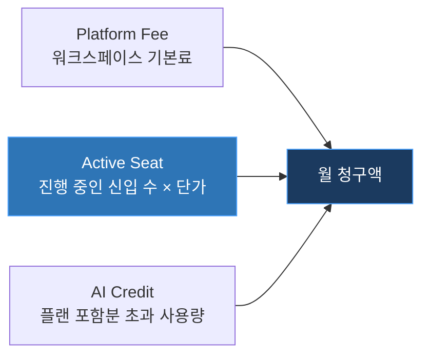
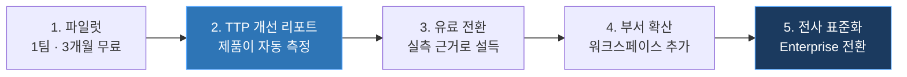

# MenTalk 수익 모델

### 채용한 만큼만 냅니다

TEAM 사수없음 · 멋쟁이사자처럼 14기 중앙해커톤

---

## 1. 과금 단위

MenTalk에서 전통적인 좌석(seat) 과금 — 직원 1인당 월 N원 — 은 맞지 않습니다. 100명 규모 회사에서 매일 제품을 쓰는 사람은 온보딩 중인 신입과 그를 맡은 멘토뿐이고, 나머지 전 직원에게 과금하면 구매 결정 자체가 막힙니다.

> [!IMPORTANT]
> **핵심 과금 단위 — 활성 온보딩 시트 (Active Onboarding Seat)**
> 온보딩 계획이 진행 중인 신입 1명 × 1개월. 30일 계획이 종료되면 시트가 자동 해제되어 그달 청구에서 빠집니다.

관리자 · 멘토 · 기존 직원은 **전원 무료, 인원 무제한**입니다. 도입 저항을 없애는 동시에 조직 전체가 제품 안으로 들어오게 만들어 확산의 기반이 됩니다.

고객은 채용하지 않은 달에 비용을 내지 않고, MenTalk은 고객의 채용이 늘면 영업 없이 매출이 따라 오릅니다. 가치와 비용이 같은 축 위에 놓입니다.

## 2. 3층 과금 구조

| 층 | 과금 요소 | 무엇에 대한 값인가 | 성격 |
|---|---|---|---|
| **1. Platform Fee** | 워크스페이스 기본료 (월정액) | 문서 저장 · 역할 권한 · 감사 로그 · 관리자 대시보드 | 고정 |
| **2. Active Seat** | 활성 온보딩 시트 (명 · 월) | 신입 1명의 첫 30일 운영 — **가치 단위** | 변동 (주 수익원) |
| **3. AI Credit** | 질문 · 계획 생성 · 재생성 · 인사이트 | LLM 추론 — **원가 연동** | 종량 (초과분만) |

Platform Fee는 도입의 문턱을, Active Seat는 성장의 기울기를, AI Credit은 마진의 하한을 각각 담당합니다.

## 3. 플랜

| | **Free** | **Starter** | **Growth** | **Enterprise** |
|---|---|---|---|---|
| 가격 | ₩0 | ₩99,000 / 월 | ₩390,000 / 월 | 별도 협의 |
| 타깃 | 팀 1개 파일럿 | 20~50인 | 50~500인 | 500인+ · 규제 산업 |
| 동시 온보딩 시트 | 2 | 5 | 20 | 무제한 |
| 시트 추가 | — | ₩19,000 / 명 · 월 | ₩15,000 / 명 · 월 | 볼륨 계약 |
| 관리자 · 멘토 · 기존 직원 | 무제한 무료 | 무제한 무료 | 무제한 무료 | 무제한 무료 |
| 문서 | 20개 / 200MB | 200개 / 2GB | 2,000개 / 20GB | 무제한 |
| AI 크레딧 | 100 / 월 | 3,000 / 월 | 20,000 / 월 | 무제한 |
| 계획 재생성 | 월 2회 | 무제한 | 무제한 | 무제한 |
| 템플릿 저장 | 1 | 10 | 무제한 | 무제한 |
| AI 인사이트 (병목 분석) | — | 주간 | 실시간 | 실시간 + 커스텀 |
| 감사 로그 보관 | 7일 | 30일 | 1년 | 무기한 + 내보내기 |
| SSO · SCIM | — | — | ✓ | ✓ |
| Dedicated VPC · DB · VectorDB | — | — | — | ✓ |
| TTP 개선 리포트 | — | — | ✓ | ✓ + 전담 CSM |

**초과 종량**

| 항목 | 단가 |
|---|---|
| AI 크레딧 1,000 | ₩9,000 |
| 문서 100개 | ₩10,000 |
| 스토리지 10GB | ₩5,000 |

연간 선결제 시 **2개월 무료** (약 17% 할인). 현금흐름과 리텐션을 동시에 확보합니다.

## 4. 계측 항목 상세

각 요소가 **원가 연동**인지 **가치 연동**인지 구분해 설계합니다. AI 사용량은 원가에 직접 붙으므로 크레딧으로 흡수하고, 시트는 원가가 거의 들지 않으므로 가치 기준으로 과금합니다.

| 계측 항목 | 단위 | 원가 | 과금 방식 | 크레딧 환산 |
|---|---|---|---|---|
| 활성 온보딩 시트 | 명 · 월 | 거의 없음 | **가치 과금** (주 수익원) | — |
| AI 질문 응답 | 회 | LLM 추론 | 크레딧 차감 | 1 |
| 30일 계획 최초 생성 | 회 | 대량 LLM | 크레딧 차감 | 50 |
| 계획 부분 재생성 | 회 | 중간 LLM | 크레딧 차감 | 20 |
| 문서 임베딩 | 100페이지 | 임베딩 API | 용량 한도 + 초과 종량 | 5 |
| pgvector 스토리지 | GB · 월 | 인프라 | 플랜 한도 | — |
| AI 인사이트 리포트 | 회 | 대량 LLM | 플랜 기능 (횟수 제한) | 30 |
| 감사 로그 보관 | 기간 | 스토리지 | 플랜 기능 | — |
| SSO · SCIM · Dedicated VPC | — | 구축 · 운영 | Enterprise 계약 | — |

> [!WARNING]
> **AI 크레딧 잔량은 신입에게 노출하지 않습니다.** 관리자 화면에서만 확인할 수 있어야 합니다.
> 신입이 "질문이 몇 개 남았지"를 의식하는 순간 질문을 참게 되고, 그것은 제품 실패입니다. 크레딧은 구매자의 언어이지 사용자의 언어가 아닙니다.

## 5. 확장 과금

확장 레버 네 가지가 모두 **고객의 성장에 자동 연동**됩니다. 추가 영업 없이 계정 단가가 오르는 구조입니다.

| 레버 | 트리거 | 매출 효과 |
|---|---|---|
| **시트 증가** | 고객사 채용 증가 | 영업 없이 자동 증액 |
| **부서 확산** | 워크스페이스 추가 | Platform Fee × N |
| **문서량 증가** | 시간이 지날수록 축적 | 상위 플랜 전환 압력 |
| **Enterprise 전환** | 보안 요구 · 규모 확대 | 계정 단가 5~10배 |

### 계정 단가 예시

> **100명 규모 IT 스타트업 · 연 30명 채용 · 평균 온보딩 기간 2개월**
> → 평균 동시 활성 시트 **5명**
> → Growth ₩390,000 / 월 · 연 **₩4,680,000**
> → LLM · 인프라 원가 월 ₩40,000 수준 · **Gross Margin 약 90%**
>
> 채용이 연 60명으로 늘면 시트는 10명으로 증가하고, 추가 영업 없이 계정 단가가 함께 올라갑니다.

## 6. 파일럿에서 유료 전환까지

MenTalk은 온보딩 진행 데이터를 **제품이 이미 수집**합니다. 입사일, 항목별 완료율, 병목 지점, 최근 활동이 관리자 대시보드에 그대로 쌓입니다. 이 데이터가 곧 전환 근거가 됩니다.

| 단계 | 내용 |
|---|---|
| **1. 파일럿** | 한 팀 3개월 무료. 실제 신입 온보딩을 그대로 운영합니다. |
| **2. 측정** | 파일럿 전후 신입 첫 업무 착수까지 걸린 기간(TTP) 변화를 리포트로 자동 발행합니다. |
| **3. 전환** | 가설이 아닌 자사 데이터로 설득합니다. 관리자 대시보드가 그대로 세일즈 자료가 됩니다. |
| **4. 확산** | 같은 조직 내 다른 부서로 워크스페이스를 추가합니다. |
| **5. 표준화** | 전사 온보딩 표준으로 자리 잡으며 Enterprise 계약으로 이어집니다. |

초기 영업 비용을 낮추면서, 다음 단계 확장을 실사용 데이터로 설득할 수 있는 경로입니다.

## 7. 설계 원칙 요약

| 원칙 | 이유 |
|---|---|
| **가치 단위로 과금한다** | 신입 수 = 고객이 얻는 가치. 전 직원 좌석 과금은 도입을 막습니다. |
| **원가는 크레딧으로 흡수한다** | LLM 사용량이 마진을 잠식하지 않도록 종량 구간을 분리합니다. |
| **쓰지 않는 달은 청구하지 않는다** | 채용이 없는 달의 부담이 없어야 이탈하지 않습니다. |
| **사용자에게 한도를 보이지 않는다** | 질문을 망설이게 만드는 순간 제품 가치가 무너집니다. |
| **성장이 곧 확장이다** | 고객의 채용 증가가 그대로 매출 증가로 연결됩니다. |

---

### 채용은 빨라졌습니다. 이제 온보딩도 빨라져야 합니다.

TEAM 사수없음 · 멋쟁이사자처럼 14기 중앙해커톤

